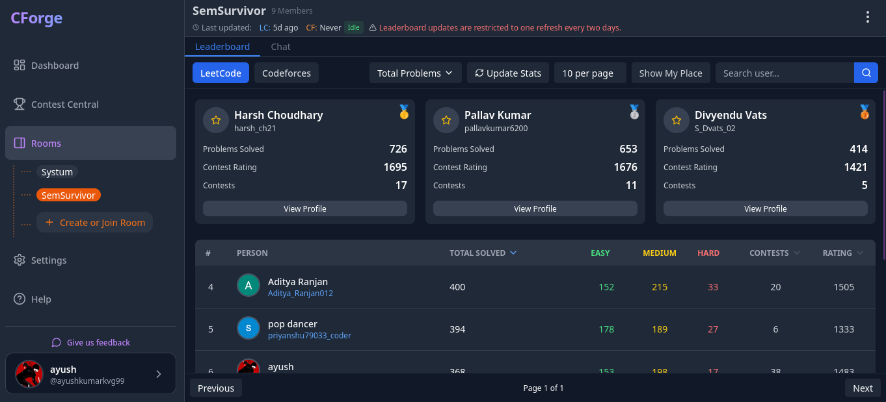

# CForge - Enhanced Coding Platform Analytics 🚀

<div align="center">


[](http://makeapullrequest.com)

[Features](#features) • [Quick Start](#quick-start) • [Documentation](#documentation) • [Tech Stack](#tech-stack) • [Contributing](#contributing)



</div>

CForge is a powerful full-stack application that aggregates and analyzes coding statistics across multiple platforms (LeetCode, Codeforces, GitHub). Built with performance and scalability in mind, it features real-time updates, Redis caching, and intelligent rate limiting.

## ✨ Key Features

- **Multi-Platform Integration**

  - LeetCode statistics and contest ratings
  - Codeforces performance metrics
  - GitHub contribution analytics
  - Real-time platform data synchronization

- **Advanced Caching System**

  - Redis-powered caching layer
  - Optimized data retrieval
  - Configurable cache invalidation
  - Reduced API load

- **Intelligent Rate Limiting**

  - Platform-specific rate limits
  - Redis-based rate limiting storage
  - Configurable limits per endpoint
  - Development mode bypass options

- **Real-Time Features**

  - WebSocket-based live updates
  - Activity heatmaps
  - Contest notifications
  - Live user statistics

- **Room-Based Competition**
  - Create private/public rooms
  - Real-time leaderboards
  - Platform-specific rankings
  - Member management
- **Leaderboards**: Compare progress with room members.
- **Public Profiles**: Share your coding journey and stats.
- **Rate Limiting**: Protects against abuse and ensures fair usage.
- **Caching**: Improves response times for frequently accessed data.
- **Health Monitoring**: Provides insights into system status and performance.

## 🛠 Technology Stack

### Backend Architecture

- **Core**: Node.js + Express
- **Database**: MongoDB with Mongoose ODM
- **Caching**: Redis for performance optimization
- **Real-time**: WebSocket implementation
- **Security**: JWT, bcrypt, and crypto
- **Performance**:
  - Redis-based rate limiting
  - Concurrent processing
  - Batch operations
  - Smart caching strategies
- **Monitoring**: Winston logging system

### Frontend Technology

- **Framework**: React.js with Vite
- **State Management**: Redux/Context
- **Styling**: TailwindCSS
- **Real-time**: WebSocket client
- **UI/UX**: Modern responsive design
- **Data Viz**: Custom chart components

### Frontend Architecture

- **Core Framework**:
  - React 18.3.1 with React DOM
  - Vite as the build tool
  - Next.js 13.4.19 integration
- **UI Components & Styling**:
  - TailwindCSS with PostCSS and Autoprefixer
  - Chakra UI for accessible, composable components
  - Material UI (MUI) for rich UI elements
  - Radix UI primitives for enhanced accessibility
  - Framer Motion for smooth animations
  - React Icons for comprehensive icon set
- **Data Management & Communication**:
  - TanStack React Query v5 for data fetching and caching
  - Socket.io-client for real-time features
  - Axios for HTTP requests
- **Visualization & Charts**:
  - Recharts for flexible data visualization
  - React Particles for interactive backgrounds
  - D3.js integration for custom visualizations
- **Developer Experience**:
  - TypeScript for type safety
  - ESLint with custom configuration
  - Vite PWA plugin for Progressive Web App features
  - Hot Module Replacement (HMR)
- **Authentication & Security**:
  - @react-oauth/google for Google Sign-In
  - JWT handling with jwt-decode
  - Secure HTTP-only cookie management
- **User Experience**:
  - React Hot Toast for elegant notifications
  - Date-fns for comprehensive date handling
  - Optimized bundle size with code splitting
  - Responsive design with Tailwind breakpoints
- **Performance Optimizations**:
  - React.lazy and Suspense for code splitting
  - Vite's build optimization
  - Asset optimization with vite-imagetools
  - Service Worker for offline capabilities

## 🚀 Getting Started

### System Requirements

- Node.js 18.0.0 or newer
- MongoDB 5.0 or newer
- Redis 6.0 or newer
- npm 8.0.0 or newer

### Installation Steps

1. **Clone and Setup**

   ```bash
   # Clone the repository
   git clone https://github.com/4xush/CForge.git
   cd cforge

   # Install dependencies
   npm install
   cd frontend && npm install
   ```

2. **Configure Environment**

   ```bash
   # Copy example environment files
   cp .env.example .env
   cd frontend && cp .env.example .env.local
   ```

3. **Configure Environment Variables**

Create a `.env` file in the `backend` directory with the following variables:

```env
# Server Configuration
PORT=5000
NODE_ENV=development

# MongoDB Connection
MONGODB_URI=your_mongodb_connection_string
MONGODB_URI_BACKUP=your_mongodb_connection_string_backup # Optional backup

# JWT Authentication
JWT_SECRET=your_jwt_secret_key

# Message Encryption
CRYPTO_SECRET=your_32_character_secret_key

# External APIs
GITHUB_TOKEN=your_github_personal_access_token
GOOGLE_CLIENT_ID=your_google_client_id

# Frontend URL for CORS
FRONTEND_URL=http://localhost:5173

# --- New Enhanced Features Configuration ---
# Caching TTLs (in seconds)
LEETCODE_CACHE_TTL=1800
GITHUB_CACHE_TTL=1800
CODEFORCES_CACHE_TTL=1800
DEFAULT_CACHE_TTL=900

# Concurrency Limits
PLATFORM_CONCURRENCY_LIMIT=5
DATABASE_CONCURRENCY_LIMIT=10
GENERAL_CONCURRENCY_LIMIT=8
EXTERNAL_CONCURRENCY_LIMIT=3

# Batch Processing Sizes
PLATFORM_BATCH_SIZE=10
ROOM_BATCH_SIZE=5
BULK_BATCH_SIZE=10

# Rate Limiting Configuration (window in ms, max requests)
AUTH_RATE_LIMIT_WINDOW=900000
AUTH_RATE_LIMIT_MAX=5
PLATFORM_REFRESH_WINDOW=600000
PLATFORM_REFRESH_MAX=1
ROOM_OPERATIONS_WINDOW=300000
ROOM_OPERATIONS_MAX=10
MESSAGING_RATE_WINDOW=60000
MESSAGING_RATE_MAX=30
API_RATE_LIMIT_WINDOW=900000
API_RATE_LIMIT_MAX=100

# Development settings
DISABLE_RATE_LIMITING=false # Set to true to disable rate limits in dev
```

````

### Installation

1.  Clone the repository
    ```bash
    git clone https://github.com/your-username/cforge.git
    cd cforge
    ```
2.  Install backend dependencies (includes new packages like `redis`, `express-rate-limit`, etc.)
    ```bash
    cd backend
    npm install
    ```
3.  Start the development server
    ```bash
    npm run dev
    ```

## 🔧 Advanced Configuration

### Rate Limiting Configuration
```env
# Authentication limits
AUTH_RATE_LIMIT_WINDOW=900000     # 15 minutes
AUTH_RATE_LIMIT_MAX=5             # 5 attempts

# Platform refresh limits
PLATFORM_REFRESH_WINDOW=600000    # 10 minutes
PLATFORM_REFRESH_MAX=1            # 1 refresh

# API general limits
API_RATE_LIMIT_WINDOW=900000      # 15 minutes
API_RATE_LIMIT_MAX=100           # 100 requests
```

### Cache Configuration
```env
# Cache TTLs (in seconds)
LEETCODE_CACHE_TTL=1800          # 30 minutes
GITHUB_CACHE_TTL=1800            # 30 minutes
CODEFORCES_CACHE_TTL=1800        # 30 minutes
DEFAULT_CACHE_TTL=900            # 15 minutes
```

### Development Mode
```env
# Bypass rate limiting in development
NODE_ENV=development
DISABLE_RATE_LIMITING=true
```

## 📚 API Documentation

### Authentication Endpoints

- `POST /api/auth/signup`: Register a new user
- `POST /api/auth/login`: Login with email and password
- `POST /api/auth/google`: Authenticate with Google
  - _Now with enhanced rate limiting and brute-force protection._

### User Endpoints

- `GET /api/users/profile`: Get current user profile
- `POST /api/users/setup-platforms`: Set up coding platform usernames
- **`PUT /api/users/platform/refresh/`**: Refresh platform statistics for the authenticated user.
  - Rate limited (e.g., 1 req / 10 min per user).
  - Supports `?force=true` & `?noCache=true`.
- Various update endpoints for user settings

### Room Endpoints

- `POST /api/rooms/create`: Create a new room
- `GET /api/rooms`: Get all rooms for current user
- `GET /api/rooms/search`: Search public rooms
- `GET /api/rooms/:roomId`: Get room details
- `POST /api/rooms/:roomId/join`: Request to join a room
- `DELETE /api/rooms/:roomId/leave`: Leave a room
- **`POST /api/rooms/:roomId/bulk-refresh`**: Bulk refresh platform data for specified users in a room.
- **`POST /api/rooms/:roomId/update-{platform}-stats`**: (e.g., `update-leetcode-stats`) Enhanced room platform updates.
  - Rate limited (e.g., 1 req / 2 hours per room).
  - Supports `?force=true`.

### Admin Room Endpoints

- `PUT /api/rooms/admin/:roomId`: Update room details
- `POST /api/rooms/admin/:roomId/admins/add`: Add a room admin
- `POST /api/rooms/admin/:roomId/kick`: Kick a user from room
- `POST /api/rooms/admin/:roomId/invite`: Generate room invite

### Message Endpoints

- `POST /api/rooms/:roomId/messages`: Send a message
- `GET /api/rooms/:roomId/messages`: Get room messages
- `PUT /api/rooms/messages/:messageId`: Edit a message
- `DELETE /api/rooms/messages/:messageId`: Delete a message
  - _Now with enhanced rate limiting._

### Public Endpoints

- `GET /api/u/:username`: Get public user profile
- `GET /api/u/hmap/:username`: Get platform heatmaps
- `GET /api/u/lc-stats/:username`: Get LeetCode question stats

### Cache Management Endpoints (New)

- `DELETE /api/users/platform/cache?platform=<platformName>`: Invalidate user's cache for a specific platform.
- `GET /api/users/platform/stats`: Get platform service statistics (cache hits/misses, etc.).

### Health Check Endpoints (New)

- `GET /api/health`: Basic health check.
- `GET /api/health/ping`: Simple ping.
- `GET /api/health/detailed`: Detailed service health (requires auth).
- `GET /api/health/cache`, `/api/health/database`, `/api/health/services`: Service-specific checks (requires auth).
- `GET /api/health/ready`: Kubernetes readiness probe.
- `GET /api/health/live`: Kubernetes liveness probe.
- `POST /api/health/restart/:serviceName`: Admin endpoint to restart a service (requires secret key).

## Architecture & Security Highlights

The backend architecture follows an MVC-like pattern with a strong focus on separation of concerns. Recent enhancements have significantly bolstered its capabilities:

- **Security**: Includes JWT authentication, password hashing, message encryption, CORS, Helmet, and now comprehensive multi-tier rate limiting and brute force protection. Input sanitization practices are in place.
- **Performance**: Leverages Redis for intelligent caching, `p-limit` for managing concurrency in external API calls and database operations, and batch processing for bulk tasks.
- **Reliability**: Implements retry logic with exponential backoff for transient API failures, graceful degradation if Redis or cache is unavailable, and robust error handling.
- **Scalability**: The design is job-queue ready (e.g., BullMQ) for handling background tasks and supports horizontal scaling.

## Troubleshooting with New Features

- **Rate Limit Errors (429 Too Many Requests)**: Check client-side request frequency or adjust rate limit ENV variables if necessary.
- **Cache Issues**: Use `DELETE /api/users/platform/cache` to invalidate cache. Check Redis connectivity if issues persist.
- **Performance Monitoring**: Utilize `GET /api/health/detailed` and `GET /api/users/platform/stats` for insights.
- **Logs**: Detailed logs are available in `backend/logs/` (e.g., `platform-controller-combined.log`, `redis-combined.log`).

## 🚀 Deployment

### Production Setup
1. Build the application
   ```bash
   npm run build
   ```

2. Configure production environment
   ```env
   NODE_ENV=production
   MONGODB_URI=your_production_mongodb_uri
   REDIS_URL=your_production_redis_url
   ```

3. Start the server
   ```bash
   npm start
   ```

### Health Monitoring
- `/api/health`: Basic health check
- `/api/health/detailed`: Detailed system status
- `/api/health/cache`: Cache system status
- `/api/health/redis`: Redis connection status

## 🤝 Contributing

We welcome contributions! Here's how you can help:

1. Fork the repository
2. Create your feature branch
   ```bash
   git checkout -b feature/amazing-feature
   ```
3. Follow our development standards
   - Use Winston for logging
   - Implement proper error handling
   - Add appropriate rate limiting
   - Include health checks
   - Add tests for new features

4. Commit your changes
   ```bash
   git commit -m 'Add some amazing feature'
   ```
5. Push to your branch
   ```bash
   git push origin feature/amazing-feature
   ```
6. Open a Pull Request

## 📝 License

This project is licensed under the MIT License - see the [LICENSE](LICENSE) file for details.

## 🙏 Acknowledgments

- LeetCode API Team
- Codeforces API
- GitHub API
- MongoDB Team
- Redis Team
- Open source community

---
Built with 💗 by Ayush
````
