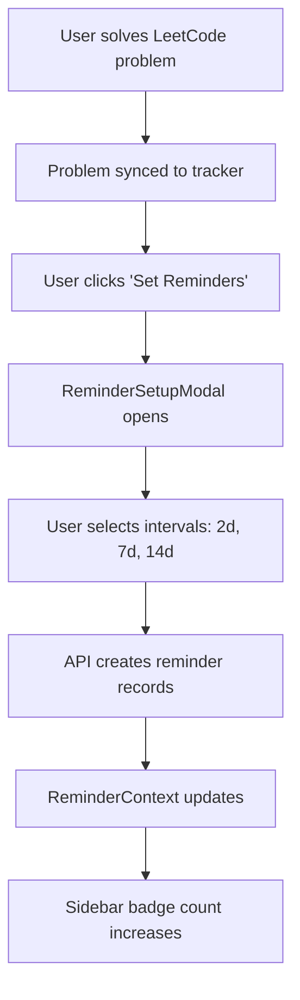
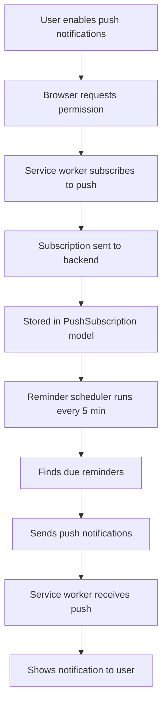
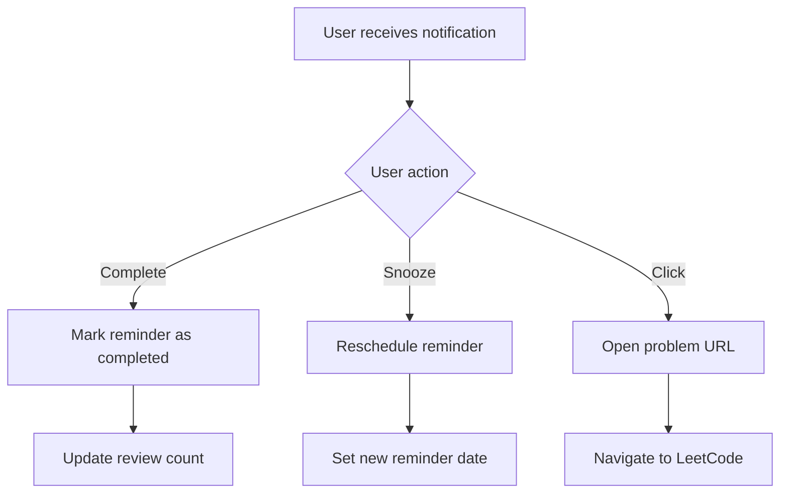

# 📱 **CForge Push Notification System Documentation**

## 🎯 **Overview**

The CForge Push Notification System provides users with intelligent spaced repetition reminders for LeetCode problems. Users receive notifications even when the app is closed, helping them maintain consistent coding practice through scientifically-backed review intervals.

---

## 🏗️ **System Architecture**

### **Backend Components**

```
backend/
├── models/
│   ├── Reminder.js                    # Database schema for reminders
│   └── PushSubscription.js            # User push notification subscriptions
├── controllers/
│   ├── reminderController.js          # Reminder CRUD operations
│   └── pushNotificationController.js  # Push notification management
├── services/
│   ├── pushNotificationService.js     # Core push notification logic
│   └── reminderScheduler.js           # Automated reminder checking
└── routes/
    ├── problemTrackerRoutes.js        # Reminder API endpoints
    └── pushNotificationRoutes.js      # Push notification endpoints
```

### **Frontend Components**

```
frontend/
├── src/
│   ├── services/
│   │   └── pushNotificationService.js # Frontend push notification service
│   ├── context/
│   │   └── ReminderContext.jsx        # Global reminder state management
│   ├── hooks/
│   │   └── usePendingReminders.js     # Reminder data hook
│   └── components/
│       └── ProblemTracker/
│           ├── NotificationPreferences.jsx  # Settings UI
│           ├── ReminderSetupModal.jsx       # Reminder creation
│           └── ReminderList.jsx             # Reminder management
└── public/
    └── sw-push.js                     # Service worker push handlers
```

---

## 🔄 **Data Flow**

### **1. Reminder Creation Flow**


### **2. Push Notification Flow**


### **3. Reminder Management Flow**


---

## 📊 **Database Schema**

### **Reminder Model**
```javascript
{
  user: ObjectId,                    // User who owns the reminder
  userSolvedProblem: ObjectId,       // Links to tracked problem
  reminderDate: Date,                // When reminder should trigger
  interval: Number,                  // Days after solving (1-365)
  status: "pending|completed|skipped", // Current state
  completedAt: Date,                 // When marked complete
  isActive: Boolean,                 // Can be disabled
  createdAt: Date,                   // Creation timestamp
  updatedAt: Date                    // Last update timestamp
}
```

### **PushSubscription Model**
```javascript
{
  user: ObjectId,                    // User who owns subscription
  endpoint: String,                  // Browser push endpoint
  keys: {
    p256dh: String,                  // Public key for encryption
    auth: String                     // Authentication secret
  },
  userAgent: String,                 // Browser information
  isActive: Boolean,                 // Subscription status
  createdAt: Date,                   // Subscription date
  updatedAt: Date                    // Last update
}
```

---

## 🔧 **API Endpoints**

### **Reminder Management**
```http
POST   /api/leetcode-tracker/problems/:problemId/reminders
GET    /api/leetcode-tracker/reminders/pending
PUT    /api/leetcode-tracker/reminders/:reminderId/complete
PUT    /api/leetcode-tracker/reminders/:reminderId/skip
DELETE /api/leetcode-tracker/problems/:problemId/reminders
```

### **Push Notifications**
```http
GET    /api/push-notifications/vapid-public-key
POST   /api/push-notifications/subscribe
POST   /api/push-notifications/unsubscribe
POST   /api/push-notifications/test
```

---

## ⚙️ **Configuration**

### **Environment Variables**
```env
# Required for push notifications
VAPID_PUBLIC_KEY=BLA-QB_UqkgCXab-zRh4S-jYwILbnvN2fMzBMTfgtYIJPzwY3T8baytr3MMV0gOXutL8mCsoGkk0B3xckpErgrM
VAPID_PRIVATE_KEY=_QsgxM8N8q2EYHKk_srLLQFdt6wcG-NVfOb4NLCaCbc

# API configuration
VITE_API_URI=http://localhost:5000/api
```

### **VitePWA Configuration**
```javascript
VitePWA({
  registerType: "autoUpdate",
  devOptions: {
    enabled: true,
    type: 'module'
  },
  workbox: {
    importScripts: ['/sw-push.js'],  // Include push handlers
    navigateFallback: '/index.html',
    cleanupOutdatedCaches: true
  }
})
```

---

## 🎨 **User Interface**

### **Notification Preferences Modal**
- **Browser Notifications Toggle**: Enable/disable basic notifications
- **Push Notifications Toggle**: Enable/disable push notifications
- **Test Button**: Send test notification
- **Permission Status**: Shows browser permission state
- **Settings Options**: Configure notification behavior

### **Reminder Setup Modal**
- **Preset Intervals**: 2 days, 1 week, 10 days, 2 weeks, 1 month
- **Custom Intervals**: 1-365 days
- **Multiple Selection**: Up to 10 reminders per problem
- **Visual Preview**: Shows when reminders will trigger

### **Reminder List**
- **Filter Options**: Today, This Week, Overdue, All
- **Action Buttons**: Complete, Snooze (1hr, 6hr, 1day, 3days)
- **Problem Context**: Shows original problem details
- **Visual Indicators**: Overdue reminders highlighted in red

### **Sidebar Integration**
- **Badge Count**: Shows pending reminder count
- **Real-time Updates**: Updates when reminders are completed
- **Visual Indicator**: Orange badge with count

---

## 🔄 **Business Logic**

### **Spaced Repetition Algorithm**
```javascript
// Reminder calculation
const baseDate = new Date(); // Problem solve date
const intervals = [2, 7, 14, 30]; // User selected intervals

intervals.forEach(interval => {
  const reminderDate = new Date(baseDate);
  reminderDate.setDate(reminderDate.getDate() + interval);
  
  createReminder({
    user: userId,
    userSolvedProblem: problemId,
    reminderDate,
    interval,
    status: 'pending'
  });
});
```

### **Scheduler Logic**
```javascript
// Runs every 5 minutes
const checkDueReminders = async () => {
  const now = new Date();
  const fiveMinutesAgo = new Date(now.getTime() - 5 * 60 * 1000);
  
  const dueReminders = await Reminder.find({
    status: 'pending',
    isActive: true,
    reminderDate: { $gte: fiveMinutesAgo, $lte: now }
  });
  
  // Send push notifications for due reminders
  for (const reminder of dueReminders) {
    await sendPushNotification(reminder.user, reminder);
  }
};
```

### **Push Notification Payload**
```javascript
const payload = {
  title: `Review Problem: ${problem.title}`,
  body: `Time to review this ${problem.difficulty} problem! (${interval} day interval)`,
  icon: '/favicon/web-app-manifest-192x192.png',
  tag: `reminder-${reminderId}`,
  data: {
    type: 'reminder',
    reminderId,
    problemUrl: problem.url,
    url: '/leetcode-tracker'
  },
  actions: [
    { action: 'complete', title: 'Mark Complete' },
    { action: 'snooze', title: 'Snooze 1 hour' },
    { action: 'open', title: 'Open Problem' }
  ],
  requireInteraction: true
};
```

---

## 🔒 **Security & Privacy**

### **Authentication**
- All API endpoints require JWT authentication
- Push subscriptions tied to authenticated users
- Service worker validates auth tokens for actions

### **Data Protection**
- Push subscriptions encrypted with VAPID keys
- No sensitive data in notification payloads
- User can revoke push permissions anytime

### **VAPID Keys**
- Generated using `npx web-push generate-vapid-keys`
- Public key shared with browsers
- Private key secured on server
- Used for push message authentication

---

## 🚀 **Deployment**

### **Development Setup**
```bash
# Backend
cd backend
npm install web-push node-cron
npx web-push generate-vapid-keys
# Add VAPID keys to .env

# Frontend  
cd frontend
npm install vite-plugin-pwa@latest
# Configure VitePWA with devOptions enabled
```

### **Production Deployment**
```bash
# Environment variables
VAPID_PUBLIC_KEY=production_public_key
VAPID_PRIVATE_KEY=production_private_key
VITE_API_URI=https://your-domain.com/api

# Build and deploy
npm run build
# Deploy to your hosting platform
```

---

## 🧪 **Testing**

### **Manual Testing**
1. **Enable push notifications** in browser
2. **Create reminders** for solved problems
3. **Test notification** using test button
4. **Verify scheduler** by checking due reminders
5. **Test actions** (complete, snooze) from notifications

### **Browser Compatibility**
- ✅ **Chrome**: Full support
- ✅ **Firefox**: Full support  
- ✅ **Safari**: Limited support (iOS 16.4+)
- ❌ **Internet Explorer**: Not supported

### **Platform Support**
- ✅ **Desktop**: Windows, macOS, Linux
- ✅ **Mobile**: Android (Chrome), iOS (Safari 16.4+)
- ✅ **PWA**: Full support when installed

---

## 📈 **Performance**

### **Optimization Strategies**
- **Efficient Queries**: Database indexes on user, status, reminderDate
- **Batch Processing**: Scheduler processes multiple reminders efficiently
- **Caching**: Service worker caches for offline functionality
- **Lazy Loading**: Components loaded on demand

### **Monitoring**
- **Scheduler Logs**: Track reminder processing
- **Push Success Rates**: Monitor delivery success
- **User Engagement**: Track completion rates
- **Error Handling**: Graceful degradation for failures

---

## 🔧 **Troubleshooting**

### **Common Issues**

**Push notifications not working:**
- Check browser notification permissions
- Verify VAPID keys are set correctly
- Ensure service worker is registered
- Check network connectivity

**Reminders not triggering:**
- Verify scheduler is running
- Check reminder dates are correct
- Ensure user has active push subscription
- Check backend logs for errors

**Service worker issues:**
- Clear browser cache and reload
- Check DevTools > Application > Service Workers
- Verify VitePWA configuration
- Check for JavaScript errors

### **Debug Commands**
```javascript
// Check push notification status
PushNotificationService.getStatus().then(console.log);

// Check service worker registration
navigator.serviceWorker.getRegistrations().then(console.log);

// Test push subscription
navigator.serviceWorker.ready.then(reg => 
  reg.pushManager.getSubscription()
).then(console.log);

// Check reminder context
useReminderContext(); // In React component
```

---

## 🎯 **Future Enhancements**

### **Planned Features**
- **Analytics Dashboard**: Track learning progress and retention
- **Bulk Actions**: Manage multiple reminders simultaneously
- **Calendar Integration**: Export reminders to Google Calendar
- **Email Fallback**: Email notifications when push fails

### **Advanced Features**
- **Social Features**: Share progress with friends
- **Gamification**: Streaks and achievements for consistent practice

---

## 📚 **Resources**

### **Documentation**
- [Web Push Protocol](https://web.dev/push-notifications/)
- [Service Workers](https://developer.mozilla.org/en-US/docs/Web/API/Service_Worker_API)
- [VitePWA Documentation](https://vite-pwa-org.netlify.app/)
- [VAPID Keys](https://blog.mozilla.org/services/2016/08/23/sending-vapid-identified-webpush-notifications-via-mozillas-push-service/)

### **Libraries Used**
- **Backend**: `web-push`, `node-cron`
- **Frontend**: `vite-plugin-pwa`, `react-hot-toast`
- **Database**: MongoDB with Mongoose

---

## ✅ **Conclusion**

The CForge Push Notification System provides a comprehensive solution for spaced repetition learning with LeetCode problems. It combines modern web technologies with proven learning science to help users maintain consistent coding practice and improve retention through intelligent reminder scheduling.

**Key Benefits:**
- 🎯 **Scientifically-backed** spaced repetition intervals
- 📱 **Cross-platform** push notification support
- 🔄 **Automated** reminder scheduling
- 🎨 **Intuitive** user interface
- 🔒 **Secure** and privacy-focused
- 🚀 **Production-ready** with comprehensive error handling

The system is designed to scale with your user base and can be easily extended with additional features as needed.

---